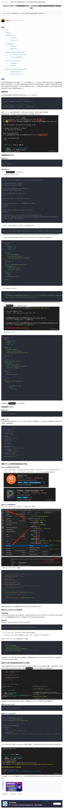

# 项目格式化

[返回目录](../README.md)

## [ESlint +Prettier配置代码格式化](https://devpress.csdn.net/viewdesign/6455f414ae650e245cfebfa1.html?spm=1001.2101.3001.6650.3&utm_medium=distribute.pc_relevant.none-task-blog-2%7Edefault%7EBlogCommendFromBaidu%7Eactivity-3-128692295-blog-129460499.235%5Ev38%5Epc_relevant_sort_base3&depth_1-utm_source=distribute.pc_relevant.none-task-blog-2%7Edefault%7EBlogCommendFromBaidu%7Eactivity-3-128692295-blog-129460499.235%5Ev38%5Epc_relevant_sort_base3&utm_relevant_index=6#prettier_147?login=from_csdn)



## vite.config.ts

### [vite-plugin-eslint](https://www.npmjs.com/package/vite-plugin-eslint)

配置vite在运行的时候自动检测eslint规范
```
 plugins: [
    eslintPlugin({
      include: ['src/**/*.ts', 'src/**/*.js', 'src/**/*.vue', 'src/*.ts', 'src/*.js', 'src/*.vue'],
      fix: true // 自动修复源代码
    })
  ],
```